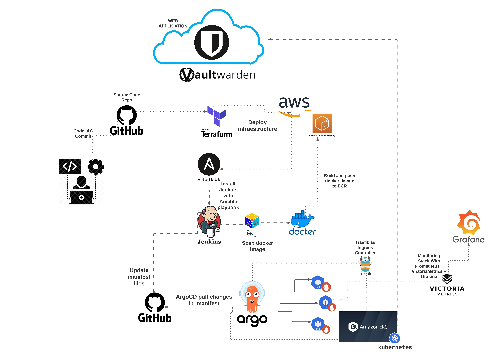
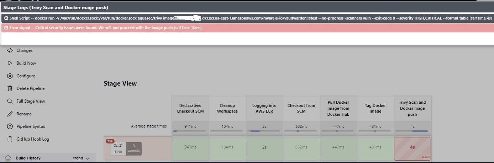
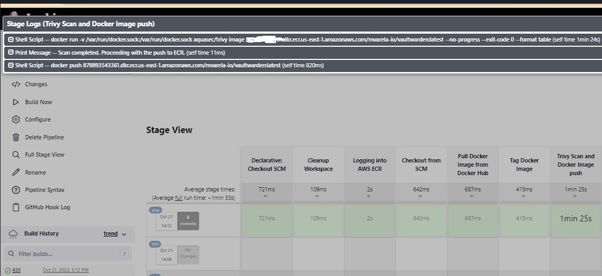
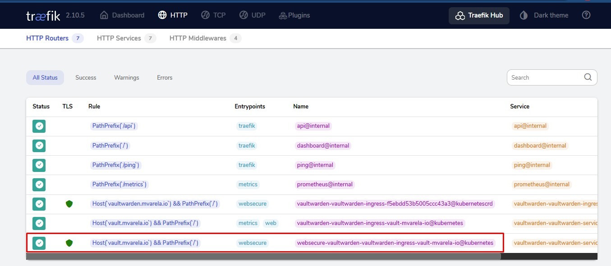
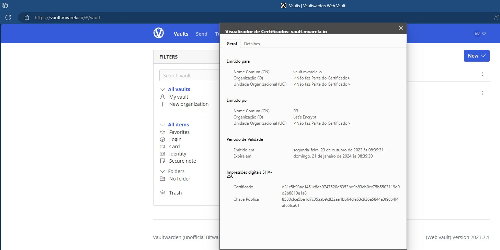

# Web Application Project

Welcome to my project portfolio! This repository documents my journey in creating a web application in several phases using modern technologies and tools. Here are the key milestones of the project:

## Phase 1: Infrastructure as Code

- I used Terraform to create infrastructure in AWS as code. All EC2 instances, networks, EKS, ECR and necessary resources were automatically provisioned.
- Used terraform modules to build a modular project, possibiliting use the same code to another project, and keep improving and addings new modules to my code.
- I integrated infrastructure deployment with GitHub Actions, ensuring that changes to infrastructure code were efficiently deployed.
- Using Ansible, I automated the installation and configuration of Jenkins on the newly created EC2 instances.

## Phase 2: Build and Deploy Pipeline

- I configured build and deploy pipelines for my application using Jenkins, ensuring that changes were automatically tested, compiled, and deployed.

I added security with DevSecOps by using Trivy to scan Docker images for critical vulnerabilities before pushing them to Amazon Elastic Container Registry (ECR).

- **Trivy Scan Fail:** This image represents a Trivy scan result for a Docker image. When Trivy detects critical vulnerabilities, the image is marked as "fail," and it won't be pushed to ECR, ensuring that only secure images are deployed.

- **Trivy Scan Done:** This image represents a Trivy scan result for a Docker image without critical vulnerabilities. When Trivy scans the image and finds no critical vulnerabilities, it's marked as "done," and the image is pushed to ECR, ensuring that only secure images are deployed.

## Phase 3: Kubernetes Deployment

- I created Kubernetes manifests using Jenkins pipelines to automate deployment configurations.
- I installed Argo CD on the Kubernetes cluster to ensure continuous deployments and application management.

- I used Traefik as the ingress controller to route application traffic.

## Phase 4: Monitoring

- Loading... This part will be done in the next months. New projects coming for now.

## Considerations and web application running

- Security was a top priority throughout the project. DevSecOps practices were implemented to identify and mitigate vulnerabilities early in the development pipeline.
- All infrastructure and deployments followed best practices to enhance reliability and maintainability.
- Automation and CI/CD pipelines were used to streamline development and deployment processes.
- The entire project was designed with scalability in mind, enabling future growth and expansion.

This is an overview of my project, demonstrating my skills in DevOps, automation, security, and container orchestration. Feel free to explore the details in each phase of this repository to learn more about the technologies and processes involved.

Thank you for checking out my project portfolio!

* I also added a README.md file in terraform folder, to give you more details about how to use it.

## Contact

**To get in touch:**
- ✉️ **Email:** [mateus@mvarela.io](mailto:mateus@mvarela.io)
- 💼 **LinkedIn:** [linkedin.com/in/mateus-varela](https://www.linkedin.com/in/mateus-varela/)
